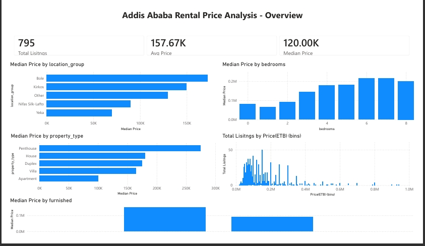
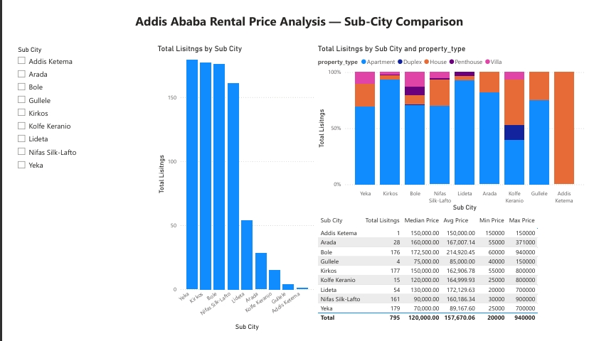
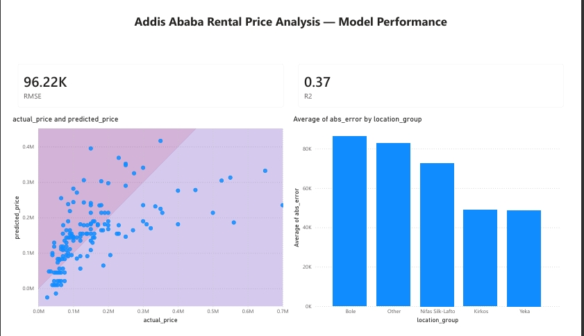

# Addis Ababa Rental Price Prediction

**Status:** Complete (v1) — Linear/Ridge Regression baseline with Power BI dashboard. Random Forest planned as future work.

## Overview
An end-to-end data science project that scrapes, cleans, explores, and models rental listing data for Addis Ababa, Ethiopia, to predict monthly rental price (ETB) from property characteristics and location. Built as a portfolio project to demonstrate real-world data collection (web scraping a JS-rendered site with bot detection) and a full ML pipeline from raw data to an interpretable model.

## Tech Stack
- **Scraping:** Python, Selenium, ChromeDriver
- **Data processing:** pandas, regex
- **Analysis & Modeling:** pandas, matplotlib, scikit-learn (Linear Regression, Ridge Regression, OneHotEncoder)
- **Environment:** Jupyter Notebook
- **CI/CD:** GitHub Actions (automated test runs on every push)

## Data
- **Source:** [Jiji.com.et](https://jiji.com.et), Ethiopia's largest classifieds platform
- **Method:** Selenium-based scraper covering all 11 sub-cities of Addis Ababa (up to 8 pages each), rather than only the general search page — this avoids over-representing Bole/Kirkos, which dominate a generic search
- **Size:** 892 raw listings scraped → 795 after deduplication and outlier filtering
- **Features:** `location_group` (sub-city, grouped for sparse areas), `property_type`, `bedrooms`, `furnished`
- **Target:** `price_etb` (monthly rent in ETB)
- **Excluded:** `size_m2` — present in fewer than 10% of listings across every sub-city, dropped rather than imputed

## Project Structure
house_project/

├── scrape_listings.py      # Selenium scraper, all 11 sub-cities
├── clean_data.py           # Parses raw text into structured columns
├── test_clean_data.py      # Unit tests for clean_data.py's parser
├── .github/workflows/tests.yml  # CI: auto-runs tests on every push
├── clean_listings.csv       # Final cleaned dataset (output of clean_data.py)
├── eda.ipynb                # Exploratory analysis, 5 sections
├── modeling.ipynb           # Feature engineering, Linear/Ridge regression
├── dashboard/                # Power BI dashboard (screenshots, .pbix, PDF export)
├── requirements.txt
├── .gitignore
└── README.md

## Setup & Installation

**Prerequisites:** Python 3.10+, Google Chrome installed

1. Clone the repo and install dependencies:
```bash
git clone https://github.com/yourusername/addis-rental-prediction
cd addis-rental-prediction
pip install -r requirements.txt
```

2. Download [ChromeDriver](https://googlechromelabs.github.io/chrome-for-testing/) matching your installed Chrome version, and update the path in `scrape_listings.py`:
```python
driver = webdriver.Chrome(service=Service(r"PATH_TO_YOUR_chromedriver.exe"), options=options)
```

3. Run the pipeline in order:
```bash
python scrape_listings.py   # produces raw_listings_balanced.csv
python clean_data.py        # produces clean_listings.csv
jupyter notebook            # open eda.ipynb, then modeling.ipynb
```

## EDA Highlights
- **Location** is the strongest price driver: Bole's median rent (ETB 172,500) is 2.5x Yeka's (ETB 70,000)
- **Property type** creates a clear hierarchy: Penthouse (ETB 275,000) > House > Villa > Apartment (ETB 100,000, but 76% of listings)
- **Bedrooms** correlate positively with price, with the sharpest jump between 2 and 3 bedrooms (+58%)
- **Furnished** listings command a 67% premium over unfurnished (ETB 150,000 vs ETB 90,000)
- Price distribution is heavily right-skewed (luxury listings up to ETB 940,000 pull the mean above the median)

Full analysis with charts in [`eda.ipynb`](./eda.ipynb).

## Modeling Results

| Model | Target | RMSE (ETB) | R² |
|---|---|---|---|
| Linear Regression | Raw price | 96,282 | 0.369 |
| Linear Regression | Log price | 104,628 | 0.255 |
| Ridge (α=1.0) | Raw price | 96,219 | 0.370 |
| Ridge (α=1.0) | Log price | 104,504 | 0.257 |

Best model: **Ridge Regression on raw price** (R² = 0.37). Log-transforming the target — despite the skewed distribution suggesting it should help — performed worse on the ETB scale, likely due to error amplification when exponentiating predictions for high-price listings.

Ridge coefficients confirm the EDA findings: property type and furnished status drive the largest price increases, while Yeka shows the steepest discount relative to the Bole baseline. Full interpretation in [`modeling.ipynb`](./modeling.ipynb).

## Power BI Dashboard

A 3-page interactive Power BI dashboard summarizing key insights and model performance.

### Page 1: Overview


KPI summary, price distribution, and price breakdowns by location, property type, bedrooms, and furnished status.

### Page 2: Sub-City Comparison


Interactive sub-city filtering with listing counts, property type mix, and a full price range summary table.

### Page 3: Model Performance


Predicted vs. actual rental price scatter plot, average prediction error by location group, and overall model metrics (RMSE: 96.22K ETB, R²: 0.37).

**Files:**
- [`addis_ababa_rental_dashboard.pbix`](dashboard/addis_ababa_rental_dashboard.pbix) — open in Power BI Desktop (free) for the full interactive version
- [`addis_ababa_rental_dashboard.pdf`](dashboard/addis_ababa_rental_dashboard.pdf) — static PDF export of all 3 pages

## Key Engineering Challenges
- **Bot detection workaround:** direct HTTP requests to Jiji returned 403 errors; Selenium with a real browser loaded the site without issue
- **Geo-blocked ChromeDriver download:** Google Storage blocked automatic driver downloads from this network; resolved with a manual download from a GitHub mirror
- **Geographic sampling bias:** scraping only the general search page over-represents Bole/Kirkos; fixed by scraping each of the 11 sub-cities independently, with early-exit logic for sparse areas

## Limitations
- Small dataset (795 listings) limits model strength — R² of 0.37 means most price variance remains unexplained by these four features
- `size_m2`, likely a strong predictor, had to be dropped due to ~90%+ missingness
- Several sub-cities had too few listings to model individually and were grouped into "Other"
- Single-platform data (Jiji only) may not represent the full Addis Ababa rental market
- `furnished` status was parsed from free text via keyword matching, carrying some risk of misclassification

## Future Work
- Train tree-based models (Random Forest, XGBoost) after completing further coursework on ensemble methods
- Expand scraping to additional listing platforms
- Re-incorporate `size_m2` if a more complete data source is found

## License
MIT
